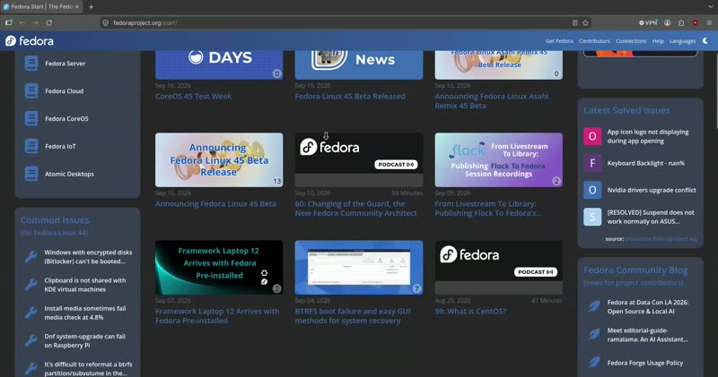
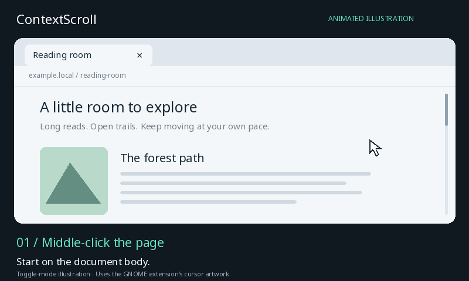
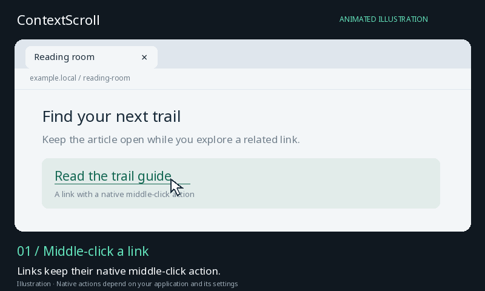

# ContextScroll

[](https://github.com/oriraz1607/contextscroll/actions/workflows/ci.yml)
[](https://github.com/oriraz1607/contextscroll/releases/latest)
[](LICENSE)

**Windows-style, context-aware middle-click autoscrolling for Linux on GNOME
Wayland and X11.**

ContextScroll adds system-wide middle mouse button scrolling while preserving
normal middle-click actions. It recognizes what is under the pointer: an item
with a recognizable native middle-click purpose keeps that behavior, while a
plain page or document surface starts autoscroll. Links still open in new tabs
and browser tabs still close immediately.

## Try ContextScroll 0.6.0

ContextScroll supports **GNOME 48+ on Wayland** and Linux desktops running
**X11**, on x86_64 and aarch64. Fedora users can install from COPR for easy
updates; other systemd-based distributions can use the portable bundle.

### Fedora (recommended)

```bash
sudo dnf copr enable oriraz/ContextScroll
sudo dnf install contextscroll
sudo systemctl enable --now contextscroll.service
systemctl --user enable --now contextscroll-context.service
```

The [ContextScroll COPR repository](https://copr.fedorainfracloud.org/coprs/oriraz/ContextScroll/)
delivers future package updates through the normal DNF update flow. To install
the standalone release RPM instead, see [Fedora RPM](#fedora-rpm).

### Portable bundle

Install the runtime dependencies listed below, then:

```bash
arch=$(uname -m)
archive="contextscroll-v0.6.0-linux-${arch}.tar.gz"
curl -LO "https://github.com/oriraz1607/contextscroll/releases/download/v0.6.0/$archive"
tar -xzf "$archive"
cd "contextscroll-v0.6.0-linux-${arch}"
./scripts/install.sh
```

On GNOME, sign out and back in once after installation so Shell can discover
the extension. Then try it: point at a page, middle-click once, move the mouse
to scroll, and click again to stop. Links and tabs keep their normal
middle-click actions.

For provenance verification, distribution dependencies, source installation,
and troubleshooting, see [Install](#install). You can also jump straight to
the [v0.6.0 release and downloads](https://github.com/oriraz1607/contextscroll/releases/tag/v0.6.0).

### What is new in 0.6.0

- Fedora RPMs and portable bundles for x86_64 and aarch64;
- smoother speed ramping at the edge of the deadzone;
- validated daemon settings and safer repair of malformed context rules;
- a real 21-second GNOME desktop recording alongside the scripted demos;
- signed build-provenance attestations, checksums, and an SPDX SBOM.

## See it in motion

### Real desktop recording

[](docs/demos/contextscroll-desktop-recording.mp4)

[Watch the 21-second desktop recording (MP4, 2.2 MB)](docs/demos/contextscroll-desktop-recording.mp4).
It shows page scrolling, opening a link in a background tab, and closing a
browser tab with middle-click.

### Scripted illustrations

The following GIFs are generated illustrations of the interactions, not desktop
recordings. Middle-click a page, move to scroll, then click to stop. The cursor
follows your mouse and indicates the vertical scroll direction.



Links and tabs keep their normal middle-click actions: open a link in a
background tab, or close a tab without activating autoscroll.



*The GIFs use the actual GNOME extension cursor artwork, but their browser
content is drawn for illustration. Application styling and native middle-click
behavior vary by desktop and browser. [Static usage instructions](#use) and
[demo sources](docs/demos/README.md) are also available.*

Highlights:

- Windows-style toggle and hold autoscrolling with vertical and horizontal
  movement;
- native middle clicks on links, browser tabs, buttons, menus, sliders, and
  editable fields;
- Firefox, Brave, Chrome/Chromium, Electron, and other accessible browsers;
- LibreOffice Writer, file managers, PDF/document/image viewers, lists,
  tables, trees, and standard desktop scroll panes;
- ordered per-user context rules for application and AT-SPI semantics;
- persistent pause/resume from GNOME Quick Settings and Extension Manager;
- GNOME Wayland support through the included Shell extension and X11 support
  through Xlib;
- no hold threshold, screenshot capture, or configurable latency parameter;
  fresh semantic decisions route immediately.

On GNOME Wayland, the normal pointer changes to a compact black cursor with a
white outline while autoscroll is active. It shows whether the actual filtered
vertical scroll is moving up or down without encoding speed. The
replacement cursor is click-through and follows physical mouse movement while
the hidden compositor pointer remains anchored at the activation point. This
keeps Chromium's tab strip away from generated wheel events without making the
cursor appear frozen. When autoscroll stops, the real pointer rejoins it.

## How it works

ContextScroll is three deliberately separate processes:

1. The tiny `contextscroll-pointer@contextscroll` GNOME Shell extension publishes
   compositor pointer coordinates and the window beneath them at no more
   than 60 Hz.
2. `contextscroll-context` runs as your desktop user. It combines those
   coordinates with AT-SPI roles to classify the accessible object beneath
   the pointer and tells the Shell bridge when to show the autoscroll cursor.
   On X11 it samples coordinates through Xlib instead.
3. `contextscroll` is a small Rust system daemon. It mirrors physical mice
   through evdev/uinput and keeps the most recent classification in a
   lock-free cache. It reports the aggregate active/inactive state and, when
   needed, a monotonic refresh request ID back to the session helper.

When the middle button is pressed with fresh context, the Rust path reads two
atomics and makes the decision immediately:

| Context under pointer | Result |
| --- | --- |
| Semantic native target: tab, link, button, menu, slider, editable field | Native middle click |
| Web/text document, list, table, canvas, scroll pane | Autoscroll |
| Unknown, stale, helper disconnected | Native middle click |

Native targets take precedence over scrollable ancestors. For example, text
inside a link remains native even though the enclosing web document scrolls.
The same rule applies to clickable link cards, semantic controls, and
application-specific AT-SPI actions outside browsers. Chromium exposes generic
left-click and context-menu actions on much of a page; those do not prove that
middle-click has a native meaning and therefore do not disable autoscroll.
Broad actions exposed by a document root or window frame are ignored as well.

Raw mouse movement can arrive just before GNOME publishes its new pointer
position. If that motion invalidated the cache, the daemon requests an
acknowledged hit-test and waits for at most 60 ms before safely falling back to
native middle-click. This bounded refresh applies only to stale or unknown
context; it is not a fixed delay.

Ending autoscroll advances a context generation. The next decision is accepted
only after GNOME has restored the hidden pointer to the replacement cursor and
the helper has classified that new position. A recent decision from the
previous autoscroll location therefore cannot consume a link or tab click.

AT-SPI and desktop D-Bus work stays on the graphical session's GLib thread.
The Rust click path never performs AT-SPI, D-Bus, subprocess,
image-recognition, or network work itself.

## Desktop support

ContextScroll uses the desktop accessibility bus for semantic recognition,
the included GNOME Shell bridge for Wayland coordinates, and Xlib coordinates
in X11 sessions. It requires:

- an AT-SPI 2 accessibility bus;
- applications that expose meaningful accessibility objects;
- GNOME Shell 48 or newer on Wayland, or an X11 display with `libX11`.

GTK, Qt, Firefox, Chromium/Electron, and most standard desktop applications
can expose AT-SPI roles. An application may expose an incomplete tree,
especially if accessibility was explicitly disabled. That context is treated
as unknown and therefore remains a native middle click.

While the helper runs, it enables the session's general AT-SPI status so
applications such as Firefox publish their semantic trees. It does not enable
the screen-reader status and restores the original setting when it exits.

This project intentionally does not inspect screenshots. Semantic roles are
faster, private, and able to distinguish a real tab from text that merely
looks like one.

## Requirements

Runtime:

- Linux with evdev and uinput;
- systemd;
- POSIX ACL tools (`setfacl`);
- Python 3;
- PyGObject with the AT-SPI 2 introspection bindings.
- `libX11` (normally already installed by XWayland).
- GLib's `glib-compile-schemas` utility.

Build:

- Rust 1.85 or newer;
- Cargo;
- internet access for the first Cargo build, or a populated Cargo cache.

Verified release installation also requires a recent GitHub CLI with
`gh attestation verify` support.

Fedora:

```bash
sudo dnf install acl cargo rust python3-gobject at-spi2-core libX11 glib2
```

Debian/Ubuntu package names are typically:

```bash
sudo apt install acl cargo rustc python3-gi gir1.2-atspi-2.0 at-spi2-core libx11-6 libglib2.0-bin
```

## Install

First stop any other daemon that exclusively grabs the same mouse.

### Fedora COPR

Fedora users can enable the
[ContextScroll COPR repository](https://copr.fedorainfracloud.org/coprs/oriraz/ContextScroll/)
and receive future ContextScroll updates through the normal DNF update flow:

```bash
sudo dnf copr enable oriraz/ContextScroll
sudo dnf install contextscroll
sudo systemctl enable --now contextscroll.service
systemctl --user enable --now contextscroll-context.service
```

On GNOME, sign out and back in after the first installation so Shell can
discover the extension.

The [v0.6.0 release](https://github.com/oriraz1607/contextscroll/releases/tag/v0.6.0)
provides Fedora RPMs and portable Linux bundles for x86_64 and aarch64.
This README describes the current source on `main`.

### Fedora RPM

Download the package for your machine, verify its build provenance, and install
it with DNF:

```bash
arch=$(uname -m)
package="contextscroll-0.6.0-1.${arch}.rpm"
gh release download v0.6.0 --repo oriraz1607/contextscroll --pattern "$package"
gh attestation verify "$package" --repo oriraz1607/contextscroll
sudo dnf install "./$package"
sudo systemctl enable --now contextscroll.service
systemctl --user enable --now contextscroll-context.service
```

On GNOME, sign out and back in to load the system extension, then run
`gnome-extensions enable contextscroll-pointer@contextscroll` if it is not
already enabled. The RPM preserves `/etc/contextscroll.conf` on upgrades and
restarts an already running system daemon.

### Source installation

To install the current development version from source:

```bash
git clone https://github.com/oriraz1607/contextscroll.git
cd contextscroll
./scripts/install.sh --from-source
```

For an existing checkout, run `./scripts/install.sh --from-source` from its root.
To install the **v0.6.0** source instead, check out its tag explicitly:

```bash
git clone --branch v0.6.0 --depth 1 \
  https://github.com/oriraz1607/contextscroll.git contextscroll-v0.6.0
cd contextscroll-v0.6.0
./scripts/install.sh --from-source
```

Verify downloaded RPMs and bundles with `gh attestation verify` before
installing them; see [SECURITY.md](SECURITY.md) for the release trust model.

The current installer verifies the bundle manifest when installing a bundle,
creates a private root-owned snapshot, verifies it again, and installs from that
snapshot. The privileged
phase never runs Cargo or reads executable content from the original
user-writable directory. It preserves an existing regular
`/etc/contextscroll.conf` and refuses a symlinked configuration.

GNOME discovers a newly installed local extension at graphical-session
startup. Sign out and back in after the first installation, and after an
update that changes the GNOME extension.

To update the installed files without starting either component:

```bash
./scripts/install.sh --install-only
```

Verify the live setup:

```bash
./scripts/diagnose.sh
```

## Test

```bash
./scripts/test.sh
```

The suite tests the Rust routing state machine, speed curve, configuration and
bounded bidirectional protocol, plus the Python semantic classifier and
protocol encoder.
It does not need root or access to physical input devices.

## Use

The default interaction is toggle mode:

1. Point at the body of a web page or other scrollable content.
2. Middle-click once.
3. Move the physical mouse to control speed and direction. The replacement
   cursor follows you while wheel events remain on the original content.
4. Click any mouse button to stop. A background stopping click is consumed;
   middle-clicking a native target such as a browser tab or link both stops
   autoscroll and performs that target's normal middle-click action.

Clearly vertical or horizontal gestures temporarily suppress cross-axis wheel
jitter, preventing small sideways movement from becoming browser navigation.
The visible cursor always follows both axes, and deliberate diagonal movement
or a change of direction immediately makes the other scroll axis available.

Point at a browser tab, link, button, menu, or editable field and middle-click
normally. With fresh context, both the press and release are forwarded
immediately.

## GNOME controls and context rules

The GNOME system menu contains a **ContextScroll** Quick Settings tile. Turning
it off pauses autoscroll, ends an active scroll immediately, restores the real
pointer, and passes all mouse input through unchanged. The choice is per-user
and persists across logins.

Open ContextScroll from Extension Manager or GNOME Extensions to edit:

- the same pause state;
- the direction-aware cursor toggle;
- ordered context rules.

Each context rule chooses native middle-click or autoscroll and can match an
application name plus an accessible role, name, required states, and required
actions. All semantic fields on one rule must match the same accessible item.
The first enabled matching rule wins, and rules can be reordered by dragging
or with the arrow buttons. New rules start disabled.
Malformed stored rules remain visible in Preferences with repair and delete
actions. Repair keeps valid match fields and disables the rule for review.

Rules deliberately override the built-in safety classifier. In particular, a
rule that forces autoscroll on a link or control suppresses its native
middle-click behavior. Invalid rules are skipped and reported in the user
service log without disabling the built-in classifier.

Hold mode is also available in `/etc/contextscroll.conf`:

```ini
MODE = hold
```

In hold mode, keep the middle button held while moving the physical mouse.
Release the button to stop.

After changing configuration:

```bash
sudo systemctl restart contextscroll.service
```

## Configuration

The installed configuration is `/etc/contextscroll.conf`:

```ini
MODE = toggle
UNKNOWN_ACTION = native
DEADZONE_PX = 15
SPEED_MULTIPLIER = 0.0112
SPEED_EXPONENT = 2.2
MAXIMUM_PX_PER_SECOND = 30000
PIXELS_PER_NOTCH = 55
MAXIMUM_DRAG_PX = 1200
TICK_HZ = 120
NATURAL_SCROLLING = false
SOCKET_PATH = /run/contextscroll/context.sock
```

`UNKNOWN_ACTION = native` is the safe default. Changing it to `scroll` makes
unsupported applications autoscroll, but can intercept native middle-click
actions because no semantic evidence is available.

`TICK_HZ` accepts 10–1000 ticks per second. The scrolling curve uses pointer
displacement beyond `DEADZONE_PX`, so speed rises smoothly from zero at the edge.
The maximum speed and pixels-per-notch settings must also produce safe wheel
event values together.

There is intentionally no click-delay or hold-duration setting.

## Inspect live context

Enable helper debug logging:

```bash
systemctl --user edit contextscroll-context.service
```

Add:

```ini
[Service]
ExecStart=
ExecStart=/usr/bin/contextscroll-context --debug
```

Then:

```bash
systemctl --user daemon-reload
systemctl --user restart contextscroll-context.service
journalctl --user -u contextscroll-context.service -f
```

For a one-time coordinate probe:

```bash
contextscroll-context --probe X Y
```

## Service control

```bash
sudo systemctl stop contextscroll.service
sudo systemctl start contextscroll.service
systemctl --user restart contextscroll-context.service
```

To remove ContextScroll:

```bash
./scripts/uninstall.sh
```

The uninstaller preserves `/etc/contextscroll.conf` and does not change any
other mouse service.

## Architecture and safety

- The Rust daemon runs as the dedicated, non-login `contextscroll` system
  account. A udev rule grants that UID access to physical mouse-class event
  nodes and `/dev/uinput`; pure keyboard nodes do not match.
- It accepts context only from the sole active, local graphical session after
  matching the socket peer's UID to logind. The peer PID is retained for
  audit logging. Ambiguous
  multi-seat and remote sessions fail closed into transparent pass-through.
- Protocol v2 lines are capped at 2048 bytes before JSON parsing. Pause control
  is a boolean, and cursor direction is bounded to neutral, up, or down.
- Context expires after 750 ms. The helper sends a 200 ms heartbeat, so a
  crashed or frozen helper automatically returns the daemon to native clicks.
- The hot path uses no mutex and performs no allocation for its context
  decision.
- Physical events are drained in kernel-sized batches on blocking poll
  threads. Inactive mice wake only for input or a bounded shutdown check.
- Wayland coordinates are capped at 60 Hz, duplicate points are coalesced,
  and accessibility queries are capped at 30 Hz.
- Each virtual mouse copies the physical device's vendor/product identity,
  mouse buttons, and relative axes, but never keyboard key capabilities. Its
  name is prefixed with `ContextScroll virtual:` so the daemon can reliably
  ignore its own output device. Hybrid mice that advertise keyboard keys use
  a separate exact-capability virtual passthrough so those keys are not
  swallowed by the exclusive grab.
- Both systemd units run unprivileged, drop all capabilities, and apply
  syscall, filesystem, namespace, network, memory, and task limits.

See [SECURITY.md](SECURITY.md) for the trust model.

## License

MIT
